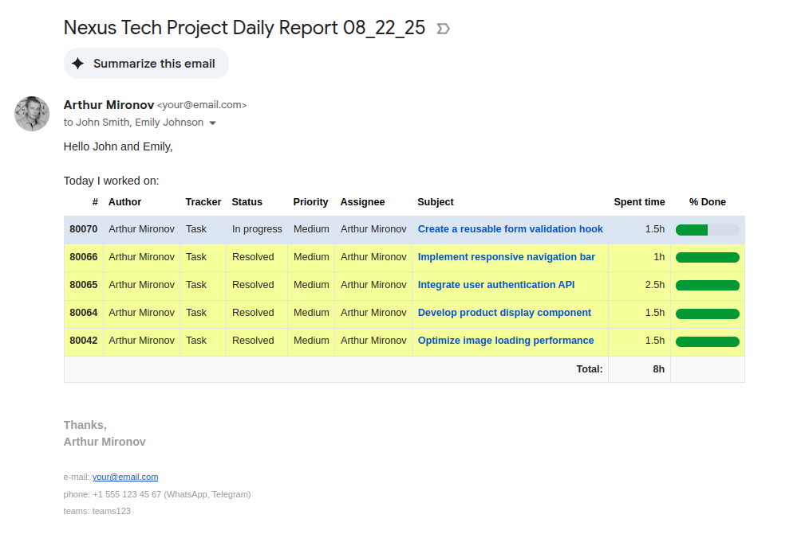

# Redmine Daily Report

This Google Apps Script automates generating and sending daily reports based on Redmine time entries to a specified client email.

**Note:** Only Gmail accounts are supported for sending emails.

Example:

### Setup Instructions:

1.  **Google Apps Script Project Setup:**
    *   Open [script.google.com](https://script.google.com/).
    *   Click "New project".
    *   Paste the provided script code (script.js).
    *   Save the project with a descriptive name.

2.  **Configuration:**
    In the script, update the `CONFIG` object with your details:
    *   `redmineUrl`: Your Redmine instance URL.
    *   `apiKey`: Your Redmine API key (find it in "My account" → "API access key").
    *   `userId`: Your Redmine user ID (found in your profile URL).
    *   `senderName`: Your name to display in "from" field (e.g., "John Smith").
    *   `toEmail`: Array of recipient emails with names in format "Name <email>".
    *   `ccEmails`: Additional CC recipients with names in format "Name <email>" (optional).
    *   `subjectText`: Email subject text (default: "Daily Report").
    *   `subjectDateFormat`: Date format for email subject (default: "MM_dd_yy").
    *   `customerName`: Customer name used in email greeting.
    *   `enableValidation`: Enable/disable time validation (checks if total hours equals exactly 8 hours).

3.  **Granting Permissions:**
    *   In the Google Apps Script editor, select the `sendDailyReport()` function from the dropdown menu.
    *   Run the `sendDailyReport()` function to test.
    *   Follow the prompts to authorize access to Gmail and external URLs.
    *   Verify that the report is sent correctly to ensure permissions are granted.

4.  **Setting Up Daily Trigger:**
    *   In the Google Apps Script editor, go to "Triggers" (clock icon in the left sidebar).
    *   Click "Add Trigger".
    *   Choose function: `sendDailyReport`.
    *   Choose event source: "Time-driven".
    *   Choose type of time based trigger: "Day timer".
    *   Select time of day: choose your preferred time (e.g., 6-7pm).

### Features:

*   **Automatic Gmail Signature Integration**: The script automatically fetches and includes your Gmail signature in reports.
*   **Time Validation**: When enabled (`enableValidation: true`), validates that total logged time equals exactly 8 hours per day.
*   **Error Notifications**: Automatically sends error notifications to your email for validation failures or system errors.
*   **Rich HTML Reports**: Generates formatted HTML reports with issue details, progress indicators, and color-coded completed tasks.
*   **Flexible Recipients**: Supports multiple recipients with CC functionality.